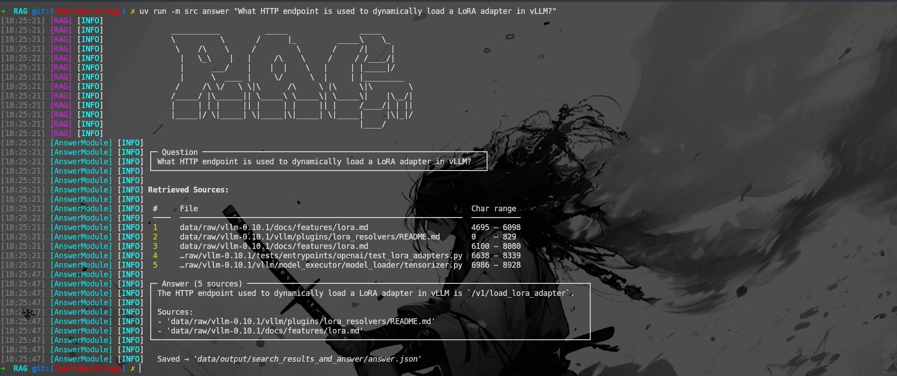
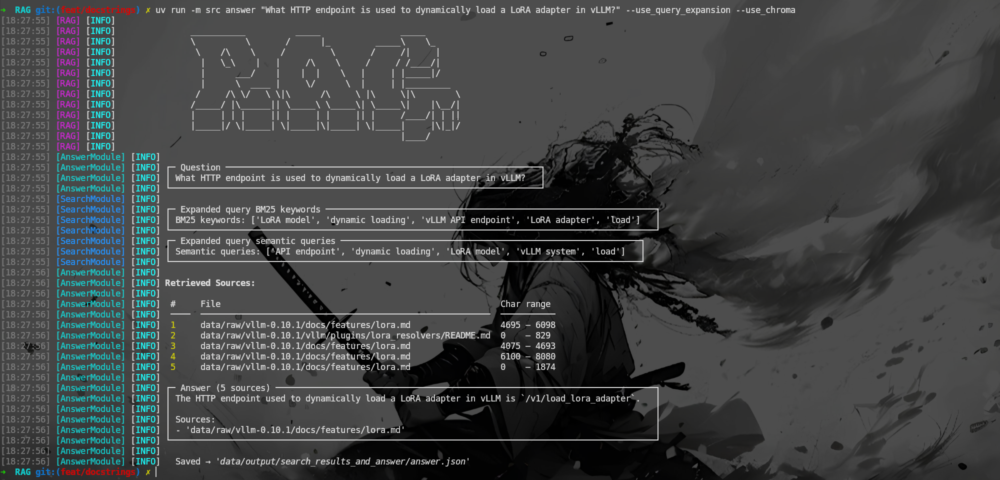
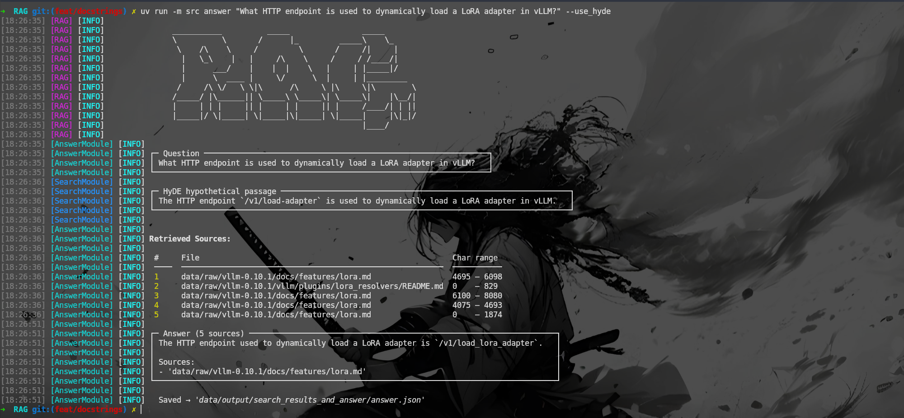

*This project has been created as part of the 42 curriculum by rpetit.*

# Retrieval-Augmented Generation (RAG) - Against the Machine

## Description
RAG (Retrieval-Augmented Generation) is an experimental project that implements a modular pipeline for answering questions using a combination of document retrieval and answer generation. The goal of this repository is to demonstrate a full RAG pipeline that ingests documents, segments them into searchable chunks, indexes those chunks with multiple retrievers, and generates concise answers to user queries while providing source attributions.

The implementation is organized under the `src/` package and includes loaders, indexers, retrieval layers, and an answer module that can be adapted to different backends and models.

## Chunking Strategy

Chunking is implemented using LangChain text splitters.

Different strategies are applied depending on the file type:

### Documentation Files

Markdown and text files are segmented using recursive text splitting,
which attempts to preserve semantic structure such as:
- headings
- paragraphs
- lists
- code blocks

### Python Files

Python source code is segmented using a code-aware splitter that
preserves logical structures such as:
- classes
- methods
- functions
- module-level documentation

Chunk metadata includes:
- source file path
- character offsets
- chunk identifiers

Chunk size and overlap are configurable through CLI arguments and
`src/config.py`.

## Retrieval Method

The retrieval layer is primarily based on **BM25S**, a modern and efficient
implementation of the BM25 ranking algorithm.

Within a Retrieval-Augmented Generation (RAG) pipeline, BM25 acts as the
lexical retriever responsible for finding documents that contain terms closely
related to the user's query. This approach is particularly effective for
technical documentation, source code repositories, API references, and other
domains where exact keyword matching remains highly valuable.

Compared to TF-IDF, BM25 introduces:

* term frequency saturation (`k1`)
* document length normalization (`b`)

These improvements generally provide better ranking quality, especially for
long documents and code-heavy datasets.

The BM25 index is built during the indexing phase and persisted on disk,
allowing fast startup and efficient query execution.

### Hybrid Retrieval

When enabled, BM25 results can be combined with semantic search results from
ChromaDB using **Reciprocal Rank Fusion (RRF)**.

This hybrid approach combines:

* the precision of lexical search (BM25)
* the semantic understanding of vector search (ChromaDB)
* robust ranking through rank fusion

### Configurable Parameters

* `bm25_k1`
* `bm25_b`
* `rrf_weights_bm25`

## Bonus Features (Disabled by Default)

The project includes several optional retrieval enhancements that can be
enabled through configuration.

### ChromaDB Semantic Search

Documents can be embedded and stored in ChromaDB to support semantic retrieval.

Unlike BM25, semantic search can retrieve relevant documents even when they do
not share the exact keywords used in the query.

### HyDE (Hypothetical Document Embeddings)

HyDE improves retrieval by generating a hypothetical answer document from the
user query and using its embedding for semantic search.

This technique can increase recall for ambiguous or complex questions.

### Query Expansion

Query expansion generates multiple reformulations of the original query before
retrieval.

Results from the expanded queries are merged and ranked, improving the chances
of retrieving relevant documents that use different terminology.

Related configuration options:

* `use_chromadb`
* `use_hyde`
* `use_query_expansion`
* `rrf_weights_chroma`
* `rrf_weights_chroma_expanded`
* `rrf_weights_bm25_expanded`
* `rrf_weights_HyDE`

## Screenshots
### Generated Answers

#### Default Answer


#### Answer with Query Expansion


#### Answer with Query Expansion + ChromaDB


#### Answer with HyDE


## System Architecture

The pipeline is organized into modular components under `src/`, designed to support a full RAG-style workflow: ingestion → indexing → retrieval → answering → evaluation.

---

### 1. Core Pipeline Flow

1. **Data Loading**
   * Loads datasets and documents from external sources.
   * Converts raw inputs into internal structured models.
   * Implemented via dataset and document loaders in `src/interfaces/` and models in `src/models/`.

2. **Indexing**
   * Handled by `src/modules/indexer_module.py`.
   * Splits documents into chunks using configurable chunking strategies (`src/config.py`).
   * Builds and updates indexes in configured storage backends:

     * BM25 index
     * Vector database (e.g., ChromaDB via interface layer)

3. **Retrieval / Search**
   * Managed by `src/modules/search_module.py`.
   * Executes queries across one or more backends via adapters in `src/interfaces/`.
   * Merges, filters, and reranks results into a final ranked set of evidence.

4. **Answer Generation**
   * Implemented in `src/modules/answer_module.py`.
   * Takes top retrieved chunks as context.
   * Uses an LLM / reader interface to generate:

     * A concise final answer
     * Minimal supporting source metadata

5. **Evaluation**
   * Implemented in `src/modules/evaluate_module.py`.
   * Measures retrieval quality and answer quality using standard metrics.
   * Supports offline benchmarking and pipeline tuning.

---

### 2. Key Modules and Responsibilities

#### `src/modules/` — Core Logic
* `indexer_module.py` → chunking + indexing orchestration
* `search_module.py` → retrieval, merging, reranking
* `answer_module.py` → LLM-based answer synthesis
* `evaluate_module.py` → evaluation of retrieval + answers

#### `src/interfaces/` — Backend Adapters
Pluggable integrations for:

* BM25 retrieval backend
* Vector DB (ChromaDB)
* Dataset loaders
* Chunking and search result formatting
* LLM / DSPy-style interfaces

#### `src/models/` — Data Structures
Defines core system entities (Pydantic models):

* Documents and datasets
* Chunks
* Questions and queries
* Search requests and results
* Final minimal answers + source metadata

#### `src/utils/` — Shared Utilities
* Logging
* JSON serialization
* Timing/profiling
* Data loading helpers
* Formatting utilities

---

### 3. Configuration & Entry Points
* **`src/config.py`**
  * Central configuration for chunk size, retrieval strategy, backend selection, and feature flags.

* **`src/rag.py`**
  * Main pipeline orchestrator tying all modules together.

* **`src/__main__.py`**
  * CLI entry point for running the system end-to-end.

---

### 4. End-to-End Interaction Flow
* Indexer module → chunks + indexes into BM25 / vector store
* Search module → retrieves + reranks relevant chunks
* Answer module → generates final response using retrieved context
* Evaluating module → assesses system performance

## Features

### Core Features
- BM25S document retrieval
- Hybrid retrieval (BM25S + ChromaDB)
- LangChain-based chunking
- Retrieval-Augmented Generation pipeline
- Source attribution
- Recall@k evaluation
- Batch dataset processing
- Structured Pydantic outputs
- Python Fire CLI
- tqdm progress bars

### Advanced Retrieval
- Query Expansion
- HyDE (Hypothetical Document Embeddings)
- Reciprocal Rank Fusion (RRF)
- Hybrid lexical + semantic retrieval

### Storage Backends
- BM25S persistent index
- ChromaDB vector store

### LLM Integration
- Qwen/Qwen3-0.6B support
- OpenAI-compatible APIs
- Ollama compatibility
- vLLM compatibility
- DSPy integration and caching

## Performance Analysis
The repository includes an evaluation module (`src/modules/evaluate_module.py`) that computes common retrieval metrics such as recall@k and can be extended to measure end-to-end answer quality. Recommended evaluation methodology:
- Prepare a held-out query set with ground-truth supporting passages.
- Run the retrieval pipeline and compute recall@k (e.g., k=1,5,10).
- Measure latency and memory for typical queries and index sizes.


### Index All

#### Docs

| Metric    | `Default` | `--use_chroma` | `--use_query_expansion` | `--use_query_expansion --use_chroma` | `--use_hyde` | `--use_query_expansion --use_chroma --use_hyde` |
|-----------|-------|-------|-------|-------|-------|-------|
| Recall@1  | 66.0% | 57.0% | 40.0% | 59.0% | 54.0% | 54.0% |
| Recall@3  | 81.0% | 57.0% | 65.0% | 78.0% | 76.0% | 68.0% |
| Recall@5  | 84.0% | 57.0% | 67.0% | 84.0% | 86.0% | 81.0% |
| Recall@10 | 92.0% | 57.0% | 76.0% | 93.0% | 93.0% | 91.0% |

#### Code

| Metric    | `Default` | `--use_chroma` | `--use_query_expansion` | `--use_query_expansion --use_chroma` | `--use_hyde` | `--use_query_expansion --use_chroma --use_hyde` |
|-----------|-------|-------|-------|-------|-------|-------|
| Recall@1  | 42.0% | 35.0% | 40.0% | 32.0% | 39.0% | 23.0% |
| Recall@3  | 65.0% | 61.0% | 65.0% | 56.0% | 64.0% | 41.0% |
| Recall@5  | 67.0% | 66.0% | 67.0% | 66.0% | 67.0% | 52.0% |
| Recall@10 | 75.0% | 77.0% | 76.0% | 75.0% | 78.0% | 70.0% |

### Index Docs

| Metric    | `Default` | `--use_chroma` | `--use_query_expansion` | `--use_query_expansion --use_chroma` | `--use_hyde` | `--use_query_expansion --use_chroma --use_hyde` |
|-----------|-------|-------|-------|-------|-------|-------|
| Recall@1  | 70.0% | 62.0% | 67.0% | 63.0% | 58.0% | 56.0% |
| Recall@3  | 88.0% | 81.0% | 88.0% | 80.0% | 83.0% | 77.0% |
| Recall@5  | 91.0% | 88.0% | 90.0% | 88.0% | 93.0% | 83.0% |
| Recall@10 | 96.0% | 96.0% | 97.0% | 95.0% | 94.0% | 93.0% |

### Index Code

| Metric    | `Default` | `--use_chroma` | `--use_query_expansion` | `--use_query_expansion --use_chroma` | `--use_hyde` | `--use_query_expansion --use_chroma --use_hyde` |
|-----------|-------|-------|-------|-------|-------|-------|
| Recall@1  | 42.0% | 34.0% | 39.0% | 31.0% | 38.0% | 23.0% |
| Recall@3  | 65.0% | 60.0% | 64.0% | 56.0% | 64.0% | 43.0% |
| Recall@5  | 69.0% | 68.0% | 68.0% | 66.0% | 69.0% | 51.0% |
| Recall@10 | 75.0% | 79.0% | 76.0% | 76.0% | 78.0% | 70.0% |

## Design Decisions
- Modularity: The codebase separates interfaces (retrieval, dataset, search results) from orchestration modules to allow swapping backends with minimal change.
- Hybrid retrieval: Combining BM25 and vector search improves recall for both factoid and semantic queries.
- Chunk metadata: Each chunk stores provenance and offsets to allow precise source attribution in answers.
- Config-driven behavior: `src/config.py` centralizes tunable hyperparameters (chunk size, overlap, top_k, etc.).

## Challenges Faced
- Document heterogeneity: documents vary widely in structure, requiring robust extraction and normalization.
- Chunk boundary selection: balancing context completeness with token limits required iterative tuning.
- Ranking fusion: deciding how to combine BM25 and vector scores without overfitting to a single dataset.


## Installation

Basic steps to install the system (project is Python-based and uv is used for dependency management):
1. Create a virtual environment and install dependencies.

```bash
make install
# or
uv sync
```

2. Install dataset.

```bash
make install-dataset
```

## RAG CLI – Command Usage Guide
This document describes how to use the `RAG` class through the command line,
based on `uv run -m src <command> <flags>`.

---

### General Syntax

```bash
uv run -m src <command> [OPTIONS]
```

Where `<command>` is one of:

| Command          | Purpose                                                                 |
|-------------------|--------------------------------------------------------------------------|
| `index`           | Index documents from a library path into BM25S / ChromaDB / chunks      |
| `search`          | Search the index for a single question                                  |
| `search_dataset`  | Search the index for every question in a dataset file                  |
| `answer`          | Search + generate an answer for a single question                       |
| `answer_dataset`  | Generate answers for a dataset of already-searched questions            |
| `evaluate`        | Evaluate generated answers against ground-truth answers                |

---

### Global / Configuration Options

These correspond to `RAG.__init__` parameters. They configure the model, the
retrieval pipeline, and RRF (Reciprocal Rank Fusion) weighting, and apply
regardless of which command you run.

| Flag                          | Type    | Default                                  | Description                                                                 |
|--------------------------------|---------|--------------------------------------------|-------------------------------------------------------------------------------|
| `--verbose`                    | bool    | `False`                                     | Enable verbose logging.                                                       |
| `--model_name`                 | str     | `openai/qwen3:0.6b`                         | Name of the language model to use.                                            |
| `--temperature`                | float   | `0.3`                                        | Sampling temperature for the language model.                                  |
| `--api_base`                   | str     | `http://localhost:11434/v1`                 | Base URL of the language model API (e.g. local vLLM/Ollama endpoint).        |
| `--api_key`                    | str     | `EMPTY`                                     | API key for the language model endpoint.                                     |
| `--max_tokens`                 | int     | `2048`                                       | Maximum tokens the language model can generate.                              |
| `--dspy_cache`                 | bool    | `True`                                       | Enable caching for the DSPy interface.                                       |
| `--use_query_expansion`        | bool    | `False`                                      | Enable query expansion (DSPy-based).                                         |
| `--use_hyde`                   | bool    | `False`                                      | Enable HyDE (Hypothetical Document Embeddings) for query expansion.          |
| `--use_chroma`                 | bool    | `False`                                      | Enable ChromaDB as a retrieval source (in addition to BM25S).                |
| `--chromadb_collection_name`   | str     | `chunks`                                     | Name of the ChromaDB collection.                                              |
| `--chromadb_path`              | str     | `data/processed/chunks/chromadb`            | Path to the ChromaDB database.                                                |
| `--bm25_k1`                    | float   | `2.0`                                        | BM25 `k1` parameter (term frequency saturation).                             |
| `--bm25_b`                     | float   | `0.75`                                       | BM25 `b` parameter (length normalization).                                   |
| `--processed_bm25_index_path`  | str     | `data/processed/bm25_index`                 | Path to the processed BM25 index.                                             |
| `--processed_chunks_path`      | str     | `data/processed/chunks/contents.json`       | Path to the processed chunks file.                                            |
| `--rrf_weights_bm25`           | float   | `1.2`                                        | RRF weight for BM25 results.                                                  |
| `--rrf_weights_chroma`         | float   | `1.0`                                        | RRF weight for ChromaDB results.                                              |
| `--rrf_weights_bm25_expanded`  | float   | `0.3`                                        | RRF weight for BM25 results from the expanded query.                        |
| `--rrf_weights_chroma_expanded`| float   | `0.5`                                        | RRF weight for ChromaDB results from the expanded query.                    |
| `--rrf_weights_HyDE`           | float   | `0.7`                                        | RRF weight for HyDE-based results.                                            |

---

### Commands

#### `index`

Indexes documents from a library path into chunks, the BM25S index, and
(optionally) ChromaDB.

```bash
uv run -m src index [OPTIONS]
```

| Flag                    | Type      | Default                  | Description                                                                 |
|--------------------------|-----------|----------------------------|---------------------------------------------------------------------------|
| `--lib_path`             | str       | `data/raw/vllm-0.10.1`      | Path to the library/directory containing the documents to index.          |
| `--maximum_chunk_size`   | int       | `2000`                      | Maximum size (in tokens/characters) of each chunk when splitting documents.|
| `--index_type`           | FileType  | `FileType.ALL`              | Which file types to index: e.g. docs, code, or all (see [FileType](#filetype-values)).|
| `--overlap`              | int       | `5`                         | Number of overlapping tokens between consecutive chunks.                  |

**Example:**

```bash
uv run -m src index --lib_path=data/raw/vllm-0.10.1 --maximum_chunk_size=1500 --index_type=ALL --overlap=10
```

---

#### `search`

Searches the index for a single question and saves the raw retrieval results
(no answer generation).

```bash
uv run -m src search --question="<your question>" [OPTIONS]
```

| Flag                | Type     | Default                                | Description                                                              |
|----------------------|----------|---------------------------------------|--------------------------------------------------------------------------|
| `--question`        | str      | *required*                              | The question to search for.                                              |
| `--k`               | int      | `5`                                      | Number of top relevant results to retrieve.                              |
| `--save_directory`  | str      | `data/output/search_results`            | Directory where search results are saved.                                |
| `--file_name`       | str      | `search_results.json`                   | Name of the output file.                                                  |
| `--search_type`     | FileType | `FileType.ALL`                          | Which file types to search in (see [FileType](#filetype-values)).        |

**Example:**

```bash
uv run -m src search --question="How does paged attention work?" --k=8 --search_type=ALL
```

---

#### `search_dataset`

Runs `search` for every question contained in a dataset file (batch mode).

```bash
uv run -m src search_dataset [OPTIONS]
```

| Flag                | Type     | Default                                                                  | Description                                                              |
|----------------------|----------|-----------------------------------------------------------------------------|----------------------------------------------------------------------------|
| `--dataset_path`    | str      | `data/datasets/UnansweredQuestions/dataset_docs_public.json`                  | Path to the dataset containing the questions to search for.              |
| `--k`               | int      | `5`                                                                            | Number of top relevant results to retrieve per question.                 |
| `--save_directory`  | str      | `data/output/search_results`                                                  | Directory where search results are saved.                                |
| `--search_type`     | FileType | `FileType.ALL`                                                                | Which file types to search in (see [FileType](#filetype-values)).        |

**Example:**

```bash
uv run -m src search_dataset --dataset_path=data/datasets/UnansweredQuestions/dataset_docs_public.json --k=5
```

---

#### `answer`

Searches for relevant information and generates an answer for a single
question.

```bash
uv run -m src answer --question="<your question>" [OPTIONS]
```

| Flag                | Type     | Default                                       | Description                                                              |
|----------------------|----------|-----------------------------------------------|----------------------------------------------------------------------------|
| `--question`        | str      | *required*                                       | The question to answer.                                                   |
| `--k`               | int      | `5`                                               | Number of top relevant results to retrieve for answering.                |
| `--save_directory`  | str      | `data/output/search_results_and_answer`          | Directory to save search results and the generated answer.               |
| `--search_type`     | FileType | `FileType.ALL`                                   | Which file types to search in (see [FileType](#filetype-values)).        |

**Example:**

```bash
uv run -m src answer --question="What scheduler does vLLM use?" --k=6
```

---

#### `answer_dataset`

Generates answers for a dataset of questions that have already been
searched (i.e. uses existing `search_dataset` output as input).

```bash
uv run -m src answer_dataset [OPTIONS]
```

| Flag                              | Type | Default                                                          | Description                                                              |
|------------------------------------|------|---------------------------------------------------------------------|----------------------------------------------------------------------------|
| `--student_search_results_path`    | str  | `data/output/search_results/dataset_docs_public.json`                | Path to the dataset containing search results for the questions to answer.|
| `--save_directory`                 | str  | `data/output/search_results_and_answer`                              | Directory to save search results and generated answers.                  |

**Example:**

```bash
uv run -m src answer_dataset --student_search_results_path=data/output/search_results/dataset_docs_public.json
```

---

#### `evaluate`

Evaluates generated answers against the ground-truth answers in a dataset.

```bash
uv run -m src evaluate [OPTIONS]
```

| Flag                       | Type | Default                                                          | Description                                                                  |
|------------------------------|------|----------------------------------------------------------------------|----------------------------------------------------------------------------------|
| `--student_answer_path`      | str  | `data/output/search_results/dataset_docs_public.json`                | Path to the dataset containing the generated answers to evaluate.               |
| `--dataset_path`             | str  | `data/datasets/AnsweredQuestions/dataset_docs_public.json`            | Path to the dataset containing the ground-truth answers to evaluate against.    |

**Example:**

```bash
uv run -m src evaluate --student_answer_path=data/output/search_results_and_answer/dataset_docs_public.json --dataset_path=data/datasets/AnsweredQuestions/dataset_docs_public.json
```

---

### FileType Values

Several commands accept a `--index_type` or `--search_type` flag of type
`FileType` (defined in `src/enums.py`). Based on the docstrings, expected
values include something like:

- `ALL` – include both documentation and code files
- `DOCS` – documentation files only
- `CODE` – code files only

---

### Combining Global Options with Commands

Global options (constructor parameters) and command-specific flags can both
be passed together. For example, to index with ChromaDB enabled and a custom
chunk size:

```bash
uv run -m src index \
  --use_chroma=True \
  --chromadb_path=data/processed/chunks/chromadb \
  --lib_path=data/raw/vllm-0.10.1 \
  --maximum_chunk_size=1500 \
  --overlap=10
```

Or to run a search with query expansion and HyDE enabled:

```bash
uv run -m src search \
  --use_query_expansion=True \
  --use_hyde=True \
  --question="How does PagedAttention reduce memory fragmentation?" \
  --k=8
```

---

### Error Handling

All commands wrap their logic in error handling:

- `ValidationError` (Pydantic) → logged as a parameter validation error.
- Any other `Exception` → logged with a generic "Error while indexing/searching"
  message.

If a command appears to silently fail, run it with `--verbose=True` to get
detailed logs from the underlying interfaces.


## Resources
- [RAG overview and use case](https://cloud.google.com/use-cases/retrieval-augmented-generation)
- [BM25s Documentation](https://bm25s.github.io/)
- [ChromaDb Documentation](https://docs.trychroma.com/docs/)
- Claude for some precise questions about implementation.


## AI Usage Disclosure
AI was used in this project in the following ways:
- The README content was drafted with assistance from an AI writing assistant to ensure clarity and completeness. Any automated contributions were reviewed and edited by the project maintainers.

## License
See the repository-level LICENSE file for licensing details.

## Author
- [@69Nesta](https://github.com/69Nesta)
